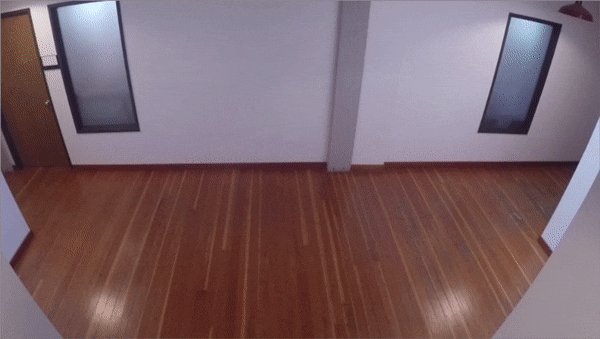

# Pedestrian Tracker C++ Demo



This demo showcases Pedestrian Tracking scenario: it reads frames from an input video sequence, detects pedestrians in the frames, and builds trajectories of movement of the pedestrians in
a frame-by-frame manner.
You can use a set of the following pre-trained models with the demo:
* _person-detection-retail-0013_, which is the primary detection network for finding pedestrians
* _person-reidentification-retail-0031_, which is the network that is executed on top of the results from inference of the first network and makes reidentification of the pedestrians

For more information about the pre-trained models, refer to the [model documentation](../../models/intel/index.md).

## How It Works

On the start-up, the application reads command line parameters and loads the specified networks.

Upon getting a frame from the input video sequence (either a video file or a folder with images), the app performs inference of the pedestrian detector network.

After that, the bounding boxes describing the detected pedestrians are passed to the instance of the tracker class that matches the appearance of the pedestrians with the known
(already tracked) persons.
In obvious cases (when pixel-to-pixel similarity of a detected pedestrian is sufficiently close to the latest pedestrian image from one of the known tracks),
the match is made without inference of the reidentification network. In more complicated cases, the demo uses the reidentification network to make a decision
if a detected pedestrian is the next position of a known person or the first position of a new tracked person.

After that, the application displays the tracks and the latest detections on the screen and goes to the next frame.

> **NOTE**: By default, Open Model Zoo demos expect input with BGR channels order. If you trained your model to work with RGB order, you need to manually rearrange the default channels order in the demo application or reconvert your model using the Model Optimizer tool with `--reverse_input_channels` argument specified. For more information about the argument, refer to **When to Reverse Input Channels** section of [Converting a Model Using General Conversion Parameters](https://docs.openvinotoolkit.org/latest/_docs_MO_DG_prepare_model_convert_model_Converting_Model_General.html).

## Running

Running the application with the `-h` option yields the following usage message:
```
./pedestrian_tracker_demo -h
InferenceEngine:
    API version ............ <version>
    Build .................. <number>

pedestrian_tracker_demo [OPTION]
Options:

    -h                           Print a usage message.
    -i                           Required. An input to process. The input must be a single image, a folder of images or anything that cv::VideoCapture can process.
    -loop                        Optional. Enable reading the input in a loop.
    -first                       Optional. The index of the first frame of the input to process. The actual first frame captured depends on cv::VideoCapture implementation and may have slightly different number.
    -limit                       Optional. Read length limit before stopping or restarting reading the input.
    -m_det "<path>"              Required. Path to the Pedestrian Detection Retail model (.xml) file.
    -m_reid "<path>"             Required. Path to the Pedestrian Reidentification Retail model (.xml) file.
    -l "<absolute_path>"         Optional. For CPU custom layers, if any. Absolute path to a shared library with the kernels implementation.
          Or
    -c "<absolute_path>"         Optional. For GPU custom kernels, if any. Absolute path to the .xml file with the kernels description.
    -d_det "<device>"            Optional. Specify the target device for pedestrian detection (the list of available devices is shown below). Default value is CPU. Use "-d HETERO:<comma-separated_devices_list>" format to specify HETERO plugin.
    -d_reid "<device>"           Optional. Specify the target device for pedestrian reidentification (the list of available devices is shown below). Default value is CPU. Use "-d HETERO:<comma-separated_devices_list>" format to specify HETERO plugin.
    -r                           Optional. Output pedestrian tracking results in a raw format (compatible with MOTChallenge format).
    -pc                          Optional. Enable per-layer performance statistics.
    -no_show                     Optional. Do not show processed video.
    -delay                       Optional. Delay between frames used for visualization. If negative, the visualization is turned off (like with the option 'no_show'). If zero, the visualization is made frame-by-frame.
    -out "<path>"                Optional. The file name to write output log file with results of pedestrian tracking. The format of the log file is compatible with MOTChallenge format.
    -u                           Optional. List of monitors to show initially.
```

To run the demo, you can use public or pre-trained models. To download the pre-trained models, use the OpenVINO [Model Downloader](../../tools/downloader/README.md). The list of models supported by the demo is in [models.lst](./models.lst).

> **NOTE**: Before running the demo with a trained model, make sure the model is converted to the Inference Engine format (\*.xml + \*.bin) using the [Model Optimizer tool](https://docs.openvinotoolkit.org/latest/_docs_MO_DG_Deep_Learning_Model_Optimizer_DevGuide.html).

For example, to run the application with the OpenVINO&trade; toolkit pre-trained models with inferencing pedestrian detector on a GPU and pedestrian reidentification on a CPU, run the following command:

```sh
./pedestrian_tracker_demo -i <path_video_file> \
                          -m_det <path_to_model>/person-detection-retail-0013.xml \
                          -m_reid <path_to_model>/person-reidentification-retail-0031.xml \
                          -d_det GPU
```

## Demo Output

The demo uses OpenCV to display the resulting frame with detections rendered as bounding boxes, curves (for trajectories displaying), and text.

> **NOTE**: On VPU devices (Intel® Movidius™ Neural Compute Stick, Intel® Neural Compute Stick 2, and Intel® Vision Accelerator Design with Intel® Movidius™ VPUs) this demo has been tested on the following Model Downloader available topologies:
>* `person-detection-retail-0013`
>* `person-reidentification-retail-0031`
> Other models may produce unexpected results on these devices.
## See Also
* [Using Open Model Zoo demos](../../README.md)
* [Model Optimizer](https://docs.openvinotoolkit.org/latest/_docs_MO_DG_Deep_Learning_Model_Optimizer_DevGuide.html)
* [Model Downloader](../../tools/downloader/README.md)
